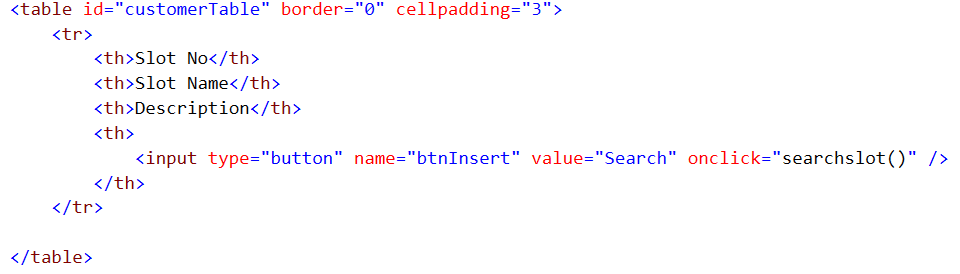
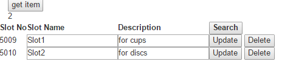

# TypeScript CRUD operations in Aspnet Core

Asp.net core, next generation of web application, uses TypeScript now. see <a href="https://www.typescriptlang.org/#download-links">link</a> here.
Asp.net core has built all necessary environment for developer to develop typescript as javascript's way. we do not worry about the gulp,task runner,etc.

We simply create a folder under "wwwroot" folder called ts.
Then we add a new typescript file from Visual Studio 2015 called app.ts.
Save file we will see not many changes as we create a new javascript file.
Open app.ts file and add some typescript codes in and save it again, we can see a new app.js file is generated under this app.ts file when you collapse this ts file.
Use require js to load this app.js in html page.
We can simply see the result from typescript scripting.

Typescript is an OO programming language.We can create a module, like the namespace in .net, and import this namespace into ts file, we  can create interface and classes in module.
We can simply create a javascript function to call class and function in this typescript. 
After typescript is created and saved, a new js file is created automatically. 
Typescript can use jquery and interact with the element and selector in html page via native javascript and jquery.
Typescript allows us to inject third party typescript files as reference.

Asp.Net Core uses typescript as js front end programming platform. After we use typescript, we may will not be willings to move back to javascript. I have tasted some sugar from using this new js technique in asp.net core. This demo project will show you how to get used to this new technique in asp.net core web site.

##Asp.net Core

Asp.net core allows us to create mvc controllers, mvc api controlers, razor view, html page for multiple platofrm web pogramming. Its startup file is so powerful that we can easily inject resources we need in this core web application. We inject httpcontext error handler as a middleware , we register logger  and  inject third party data sources in this startup file. We build environment in appsettings.json file , so we can get appsetting key/value pairs and connection strings, etc from this json file to maintain the application level data. We add security policy definitions in startup file so we can protect web services in backend and stop cross domain calls and more such as Authentication,CORS,Routing,Session,Routing, and Diagnostics, etc. We set up middleware (classic httpmodule/httphandler in asp.net) in this startup file to handle request and response via Run Map Use.

We can ignore asp.net MVC pattern in core and simply use html page in wwwroot folder, html page will use js framework to do CRUD operations in server side. This allows us to develop a light weight single web page application quickly. in startup middleware, we need to add app.useidentity after staticfile to make sure wwwroot is accessed by public.

Asp.net Core's power is its capability of developing loose coupled enterprise based responsive web applications for modern multiple devices cross platforms such as Apple IOS. I have developed an internal multiple tier Tea Inventory project in asp.net core by using anguar js 1.5, httpclient web api proxy, wep api 2, and asp.net core entity frameworks as well as SQL server 2016. Now I want to show you how to do typescript pogramming in asp.net core web application in an easy way.

##Asp.net Core Middleware

Httpmodule for file name retriving and httphandler for other http requests in asp.net 4 pipeline, both are registered in web.config, are disappeared in asp.net 5 together with global.aspx , web.config, and application life cycle. Asp.net 5 uses middleware to replace all of them.

### Error handler
The first middleware in asp.net 5 is the error handler in default startup file such as below
app.UseExceptionHandler("/Home/Error");

We can create a custom error handler class to manage errors , to remove above default error hander, and add the custom handler to the middleware. This error handling class injects a chaining requestdelegate into the class to link all middlewares together. After that a task is created to deploy the task this middleware wants to deploy. When this class is ready, we can then simply add this handler to the middleware as below
app.UseMiddleware(typeof(TeaErrorHandler));

This middleware will manage all exceptions from the context that go through the eentire pipeline middleware.  

###Add cors policy
CORS is the headache in asp.net 4. asp.net 5 and core can elegantly sort out the mess problems for developers. If we want to enable cors for a controller, we simply use [enablecors("corepolicy")] attribute to open a hole for this secured api controller. How api controller knows corepolicy, we do this in startup middleware. we add a corepolicy in startup configure method as below

<pre>
 services.AddCors(options =>
            {
                options.AddPolicy("CorsPolicy",
                    builder => builder.AllowAnyOrigin()
                    .AllowAnyMethod()
                    .AllowAnyHeader()
                    .AllowCredentials());
            });
</pre>

Then we register this policy in middleware for checking. see example below

app.UseCors("CorsPolicy")

that is it. now we can add this policy to controller for CORS.

###Appsettings.json

Web.config has been replaced by this json file. so we can set sql connection string here, we can set key/value pairs here. Then we can call parameters from this json in environment for parameter management in application. we of course need to chain this to middlware for application that can acknowledge this. see the code below

   services.Configure<AppSettings>(Configuration.GetSection("AppSettings"));

Now we can say the data in json can be seen by the controller, for example , now we can inject the setting data to account controller as below
<pre>
  private readonly AppSettings _appSettings;

        public AccountController(IOptions<AppSettings> appSettings)
        {
             _appSettings=  appSettings.Value;
        }
        
        public IActionResult login(){
          ...
          claims.Add(new Claim(ClaimTypes.Role, _appSettings.AuthKeys.AdminPolicyKey, ClaimValueTypes.String, Issuer));
          var userIdentity = new ClaimsIdentity(_appSettings.AuthKeys.SuperSecureLogin);
          ...
        }
</pre>

From this process, we can add any necessary dummy data into appsetting.json for applicaiton. we can easily manage the resorces in this json file as we did in appsetting tag in web.config. 

Of course, we can make asp.net 5 core a big gut via add middleware in. 

##TypeScript in Asp.net Core

TypeScript can be installed in various ways, VS 2015 has taken typescript as a default js programming in vs 2015 asp.net core. Typescript 2 now is available, namespace is invented to represent internal module and module now can be the external module.
TypeScript is module design pattern programming language. We develop different modules that we added them as a reference to be used in different instance classes. The programming is as easy as C# if you know C#. The following steps are briefly documented how to develop a demo typescript CRUD operations in Asp.net Core Tea Inventory web application.

###add jquery to typescript
Asp.net core has jquery default loaded. However, if we do not let TypeScript know Jquery, if we run $ in typescript, we get error, so we need a way to integrate jquery to typescript, knockout to typescript, angular js to typescript,etc. It is an easy way I found here to make those integration worked. That is

1, Us Nuget to download Jquery.TypeScript.DefinedType package to asp.net core. open reference to find out the downloaded package and right click it, open file in window explorer, now we copy the jquery.d.ts or knockout.d.ts to wwwroot folder.

2, download js such as knockoutjs from bower.json, knockoutjs will be added into Lib folder in wwwroot.

3, add jquery.d.ts or knockout.d.ts files to the app.ts file, write the codes that use ko and $, TypeScript does not tell us the error, save file and add knockout-raw.js file to the html page.

4, add the generated app.js file that contains ko and $ from ts file to the end of the < body> tag. this can allow ko find out the window.document.body DOM and run the code.

###1, Create a new asp.net Core web app

Open VS 2015, select new project , web, and asp.net core web application to create a new asp.net web core application.
Create a new folder called api under controllers folder, Add a new controller called SlotsController.cs.
Create a folder called Slots under views folder, add a new item called index.cshtml in this folder.
Add attributes at the top of the controller as below
<pre>

    [Route("api/Slots")]
    [EnableCors("CorsPolicy")]
    [Authorize(Policy = "adminpolicy")]
public class SlotsController : Controller
{
private readonly InventoryContext _context;        	
private ILogger<SlotsController> _logger;
public SlotsController(InventoryContext context, ILogger<SlotsController> logger)
{
            _context = context;
            _logger = logger;
 }
.......
 }
 </pre>
 
Asp.net Core is  the .net web development platform with dependency injection automatically enabled, so we can simply inject the data source InventoryContext and microsoft logger service in API controller easily, we do not need to download third party dependency injection IoC containers. Here, _context is the data source we created in asp.net core Entity Framework data access layer for this web application.
 
Create Get,  Put, Delete,  and Post actions in this controller as the example below. 
<pre>
        [HttpPost]
        public async Task<IActionResult> Post([FromBody] Slot slot)
        {
            if (ModelState.IsValid)
            {
               _context.Slots.Add(slot);
                _logger.LogInformation((int)1, "Add slot to database");
                await   _context.SaveChangesAsync();          
            }
             return  Json("done");
        }
        [HttpGet]
        public async Task<JsonResult> Get()
        {
            List<Slot> result = new List<Slot>();       
            if (ModelState.IsValid)
            {
                IQueryable<Slot> rtn = from temp in _context.Slots select temp;
                _logger.LogInformation((int)2, "get slot from database");
                result = rtn.ToList();
            }
            return  Json(result);
        }
        public int GetnewId()
        {
            int id = 0;
            if (ModelState.IsValid)
            {
                if (_context.Slots != null)
                {
                    if (_context.Slots.Count() > 0)
                    {
                        IQueryable<Slot> rtn = from temp in _context.Slots select temp;
                        _logger.LogInformation((int)3, "get new id slot from database");
                       id = rtn.ToList().Max(x => x.SlotNo) + 1;
                    }
                    else
                    {
                        id = 1;
                    }
                }
                else
                {
                    id = 1;
                }
            }
            return id;
        }

        [HttpGet("{id:int}")]
        public async  Task<JsonResult> Get(int id)
        {
            Slot result = new Slot();
            if (ModelState.IsValid)
            {
                result = _context.Slots.FirstOrDefault(c => c.SlotNo == id);
                _logger.LogInformation((int)4, "get each slot from database");
            }
            return Json(result);
        }

        [HttpPut]
        public async Task<IActionResult> Put([FromBody] Slot jslot)
        {
            var result= _context.Slots.FirstOrDefault(c => c.SlotNo == jslot.SlotNo);
            if (ModelState.IsValid)
            {
                result.SlotNo = jslot.SlotNo;
                result.SlotName = jslot.SlotName;
                result.Description = jslot.Description;
                _context.Slots.Attach(updateSlot);
                _context.Entry(updateSlot).State = System.Data.Entity.EntityState.Modified;
               _logger.LogInformation((int)6, "update slot from database");
                await _context.SaveChangesAsync();
            }
            return Json("done");
        }

        [HttpDelete]
        public async Task<IActionResult> Delete(int id)
        {
            if (ModelState.IsValid)
            {
                var result= _context.Slots.FirstOrDefault(x => x.SlotNo == id);
                _context.Entry(updateSlot).State = System.Data.Entity.EntityState.Deleted;
                _logger.LogInformation((int)2, "delete slot from database");
              await  _context.SaveChangesAsync();
            }
            return Json("done");
        }

</pre>
Now an Asp.net web api has been created for front end developent.

##2, TypeScript Front End development
At moment, we forget about angular js. We use built in typescript in asp.net core for front end development.
Create a folder called ts under wwwroot folder and add a new item , select typescript and create a new app.ts file under this new folder
Add  below code to app.ts 
<pre>
module slotlocal
{
    interface Islot {
        id: number;
        name: string;
        desc: string;
        SelectSlot(callback:any);
    }
    export class Slot implements Islot {
        public id: number;
        public name: string;
        public desc: string;
        public SelectSlot(callback: any): void {
            $.ajax({
               method: "GET",
                url: "AllSlots"
            }).then(callback, function (err) {
                    console.log(err);
            });
        }
    }
}

function searchslot() {
    let slotall = new slotlocal.Slot();
    slotall.SelectSlot(callbacka);
}

function callbacka(data)
{
    $.each(data, function (key, val) {
        var tableRow = '< tr>' +
            '< td>' + val.slotNo + '< /td>' +
            '< td>< input type="text" value="' + val.slotName + '"/>< /td>' +
            '< td>< input type="text" value="' + val.description + '"/>< /td>' +
            '< td>< input type="button" name="btnUpdate" value="Update" /> < input type="button" name="btnDelete" value="Delete" />< /td>' +
            '< /tr>';
        $('#customerTable').append(tableRow);
    });
}
</pre>

Here, we simple define a module that actually is a namespace. In this module, we add an interface and class that can be exported (can be seen in public). We enable Jquery in typescript and then we embed $.ajax call in typescript, This section programming is similar to C#.
Then we create a function to consume this class in typescript.  Function in TypeScript can access DOM directly to send or get data from DOM. W call function here is a middle tier. DOM is front end view, and typescript is the backend. This middle tier glue DOM view and typescript class together. So you forget about javascript here.DOM can call this function directly. This function is the javascript function in typescript. It plays key role in exposing typescript class to DOM.
Now in Razor cshtml page add some html controls in as example below

After Click search button , we can see two records are displayed as below

### 3, Summary
Now we can see the typescript in vs 2015 asp.net core can be used to develop CRUD operations in asp.net core application easily. 

